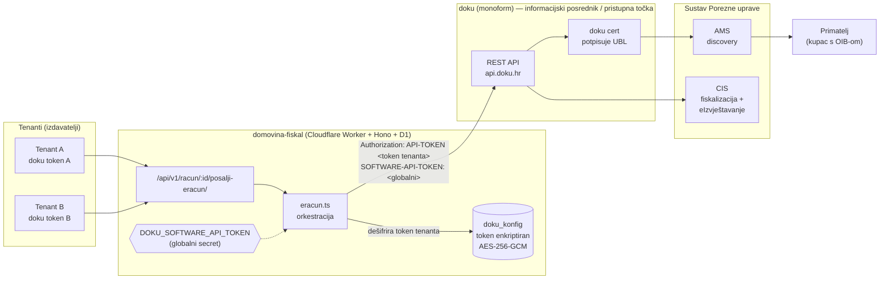
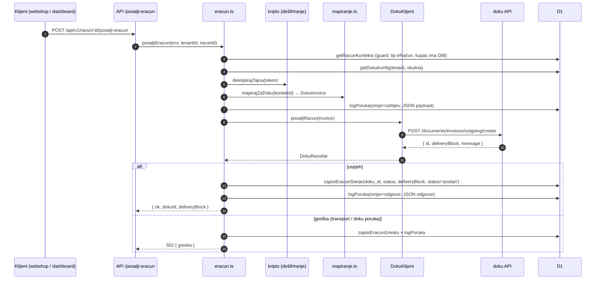
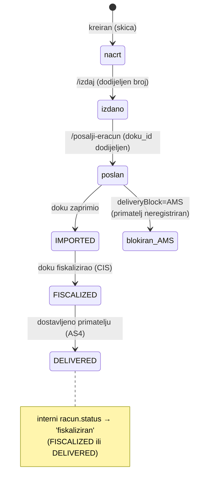
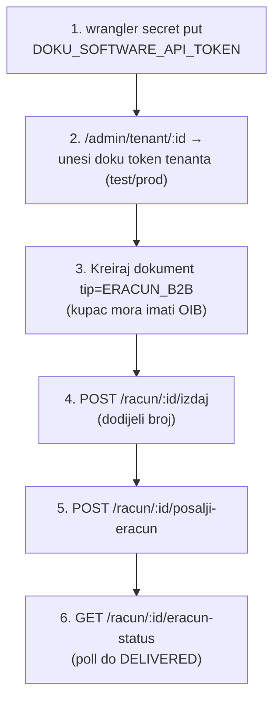

# eRačun 2.0 preko posrednika doku — implementirano (MVP)

> Stanje: **implementirano 2026-07-06** u `backend/` (typecheck + wrangler dry-run build prolaze,
> migracija 0006 aplicirana lokalno). **Netestirano end-to-end** — čeka doku pristupne podatke.
> Izvori znanja: `docs/knowledge/13-provideri-krajolik.md` (doku profil, API, cjenik),
> `15-ekonomija-i-troskovi.md` (zašto posrednik, ne vlastita PT), `03-fiskalizacija-2.0-eracun.md`.
> Za alternativu „vlastita pristupna točka" vidi `vlastita-pristupna-tocka-build.md`.

## 1. Odluka: model i zašto

**Model = BYO-key multitenant** (bring-your-own-key). Svaki tenant unosi **svoj** doku
`API-TOKEN`; **doku naplaćuje svakom tenantu direktno**. Naša integracija se doku-u predstavlja
jednim globalnim `DOKU_SOFTWARE_API_TOKEN` (isti za sve tenante). Time nemamo naplatu, reseller
ugovor, ni compliance teret — doku je pristupna točka koja **svojim certom** gradi/potpisuje/šalje
UBL i radi AMS discovery + (opcionalno) fiskalizaciju/eIzvještavanje.

**Ključna arhitektonska odluka:** slanje ide preko doku `POST /documents/invoices/outgoing/create`
(**strukturirani JSON — doku sam gradi UBL 2.1 HR CIUS**), NE preko `/upload` (gdje bismo slali
vlastiti UBL). Time je za MVP zaobiđen vlastiti UBL generator (gap-analiza `99` stavka 3, bloker
R17 `fin/2024` shema). Kad/ako zatreba puna kontrola nad UBL-om → prijeći na `/upload`.

## 2. Tok slanja (sequence)

`deliveryBlock: "AMS"` znači da primatelj **nije registriran** za eDelivery — doku ga nije mogao
dostaviti (fallback: eIzvještavanje o nedostavljivosti). Prije slanja može se provjeriti:
`POST /api/v1/eracun/provjeri-primatelja { oib }` → AMS lookup preko doku-a.

## 3. Životni ciklus statusa računa

doku exchange status se dohvaća pollom (`GET /api/v1/racun/:id/eracun-status`; webhook
`document.status_change` postoji kod doku-a ali payload nije javno dokumentiran).

- doku `exchange.status` ∈ `IMPORTED → FISCALIZED → DELIVERED`.
- doku `payments.status` ∈ `UNPAID / PARTIAL / COMPLETE / OVERPAID` (eIzvještavanje o naplati).
- Interni `racun.status`: `poslan` (IMPORTED/nepoznato) → `fiskaliziran` (FISCALIZED/DELIVERED).

## 4. Što je dodano u kod

| Sloj | Datoteka | Sadržaj |
|---|---|---|
| Migracija | `backend/migrations/0006_eracun_doku.sql` | `doku_konfig` (token enkriptiran, per-tenant/okolina) + `racun` stupci (`doku_id`, `eracun_status`, `eracun_delivery_block`, `eracun_zadnja_provjera`, `eracun_greska`) |
| Kripto | `src/kripto.ts` | `enkriptirajTajnu` / `dekriptirajTajnu` — isti envelope (per-red DEK + KEK iz `ENC_MASTER_KEY`) kao certifikati |
| Klijent | `src/eracun/doku.ts` | `DokuKlijent`: `posaljiRacun` (/create), `dohvatiStatus`, `provjeriPrimatelja` (/ams), `registrirajZaZaprimanje` (/accounts/me/ams), `ping` + tipovi |
| Mapiranje | `src/eracun/mapiranje.ts` | `RacunKontekst` → `DokuInvoice` (supplier/buyer/lines/payment); `dokuTaxCategory()` ⚠️ |
| Orkestracija | `src/eracun/eracun.ts` | `posaljiEracun`, `osvjeziEracunStatus`, `provjeriPrimatelja`, `registrirajZaZaprimanje` |
| DB helperi | `src/db.ts` | `getDokuKonfig` / `listDokuKonfig` / `upsertDokuKonfig` / `setDokuAmsRegistriran` / `zapisiEracunSlanje` / `zapisiEracunStatus` / `zapisiEracunGresku`; `logPoruka` proširen |
| API rute | `src/api/racuni.ts` | `POST /racun/:id/posalji-eracun`, `GET /racun/:id/eracun-status`, `POST /eracun/provjeri-primatelja`; `ERACUN_B2B/B2G` mapiran (dijeli `racun` slijed) |
| Admin | `src/admin/{app,views}.ts` | forma za doku token po tenantu + kartica statusa |
| Config | `src/types.ts`, `wrangler.toml` | `Env.DOKU_SOFTWARE_API_TOKEN` secret |

### doku API površina (iz `https://api.doku.hr/openapi/v1.json`)
- Auth: `Authorization: API-TOKEN <token>` + `SOFTWARE-API-TOKEN: <guid>`.
- Base: PROD `https://api.doku.hr`, TEST `https://api-test.doku.hr`.
- Slanje: `POST /documents/invoices/outgoing/create` (JSON) → `{ id, deliveryBlock, message }`.
- Status: `GET /documents/invoices/outgoing/{id}` → `exchange.status`, `payments.status`.
- AMS: `POST /ams { scheme, identifier }` → `{ mpsEndpoint }` (404 = neregistriran).

## 5. Tok korištenja (produkcija)

## 6. ⚠️ Otvoreno prije produkcije

1. **`taxCategory` konvencija (BLOKER za točnost PDV-a).** doku openapi ne dokumentira značenje
   `taxCategory` stringa na stavci, a stavka **nema** zasebno polje za PDV stopu. Pretpostavka u
   `mapiranje.ts::dokuTaxCategory()`: `S25/S13/S5` (kategorija+stopa) za oporezive, goli kôd
   (`Z/E/AE/O`) inače. **Potvrditi na doku TEST okolini** čim stignu kredencijali. Sve je izolirano
   u jednoj funkciji — trivijalno za uskladiti.
2. **Kredencijali.** Bez doku `API-TOKEN`-a (per-tenant) i `SOFTWARE-API-TOKEN`-a (naš) tok je
   netestiran. Traži se mailom na `hello@doku.hr` (vidi §7).
3. **Webhook.** doku ima `document.status_change`, ali payload nije javno u specu — zasad pollamo
   statuse. Kad dobijemo doc → dodati webhook endpoint (Basic auth, retry×3, timeout 2 s).
4. **Zaprimanje ulaznih eRačuna** (`/documents/invoices/incoming`) i **eIzvještavanje o naplati**
   (`/outgoing/{id}/payments`) — API postoji, orkestracija još nije napisana (sljedeća faza).

## 7. Onboarding / blokada doku računa (operativno)

- Login `stepanic@italk.hr` na doku **ne prolazi**: doku je „prije par mjeseci automatizmom"
  kreirao račun za pravni entitet **ITalk** (jer je ITalk 8 godina koristio `solo.com.hr`), ali
  taj račun **nije aktiviran**. Password reset **ne pušta unutra**; direktan login odbijen jer
  **već postoji pravni entitet** za taj OIB.
- **Akcija u tijeku:** kontaktiran `hello@doku.hr` (2026-07-06/08) da aktiviraju/oslobode postojeći
  entitet i izdaju pristupne podatke + `SOFTWARE-API-TOKEN` za integraciju.
- Do razrješenja: koristiti doku **TEST** okolinu (`api-test.doku.hr`) čim se dobiju test-tokeni,
  potvrditi `taxCategory` (§6.1), pa tek onda prod.

## 8. ePorezna: ovlaštenje za SLANJE vs adresa za ZAPRIMANJE — KLJUČNO za onboarding

U FiskAplikaciji (Fiskalizacija 2.0 → Administracija) postoje **dvije neovisne** stvari:

| Tab | Čemu služi | Koliko istovremeno |
|---|---|---|
| **Ovlaštenja za fiskalizaciju** | pristupna točka **šalje/fiskalizira** izlazne eRačune u ime obveznika (preko punomoći, svojim certom) | **VIŠE** — može ih biti više aktivnih |
| **Adrese za zaprimanje eRačuna** | **pretinac** za ULAZNE eRačune | **SAMO JEDNA aktivna** po OIB-u |

**Zašto samo jedan pretinac:** AMS discovery razrješava OIB primatelja na **točno jednu** pristupnu
točku (jedan MPS endpoint) — vidi `docs/knowledge/12-*` §2.3 (`Create()` = registracija **ili
migracija**, uz potvrdu obveznika u ePorezna). Potvrda ("Prihvati") nove adrese za zaprimanje →
prethodna **automatski postaje neaktivna** (migracija). **Ne mogu dva pretinca.**

Statusi adrese za zaprimanje: **Potvrđen** (aktivan inbox) · **Čeka potvrdu** (posrednik
pre-registrirao, još NIJE aktivan — bezopasno dok se ne potvrdi) · **Neaktivan** (bivši/deaktiviran).

**Posljedica za multitenant onboarding (VAŽNO):** tenant koji već **prima** preko drugog posrednika
(npr. Pondi/ePoslovanje kroz fira.finance) može **slati preko nas (doku) BEZ diranja pretinca** —
dovoljno je da u „Ovlaštenja za fiskalizaciju" doda **doku OIB `32234297847` (Monoform)**. **NE smije
"Prihvatiti" doku adresu za zaprimanje** osim ako želi preseliti inbox s Pondija na doku (čime gubi
Pondi pretinac). Slanje i zaprimanje su neovisni kanali.

> Primjer ITalk (2026-07): Ovlaštenja = Monoform (09.07.2026) + Pondi (27.11.2025), oba OK. Adrese za
> zaprimanje = **Pondi „Potvrđen"** (aktivan inbox preko fire), **Monoform „Čeka potvrdu"** (NE
> potvrđivati — inače se gubi fira inbox), Moj-eRačun „Neaktivan". → ITalk je za **slanje preko doku-a
> već spreman**; ne treba mijenjati pretinac.

Izvori: [PU 8047](https://porezna-uprava.gov.hr/hr/izdavanje-i-primanje-eracuna-i-fiskalizacija-eracuna/8047),
[ePoslovanje — odabir PT za zaprimanje](https://eposlovanje.hr/dokumenti/upute-odabir-pt-za-zaprimanje-eracuna.pdf),
[Fina — potvrda posrednika u FiskAplikaciji](https://www.fina.hr/digitalizacija-poslovanja/e-racun/upute-za-potvrdu-informacijskog-posrednika-u-sustavu-eporezna-fiskaplikacija),
[PU FiskAplikacija upute v4.0 (doc 185)](https://porezna.gov.hr/fiskalizacija/api/dokumenti/185). Pristup 2026-07-09.
