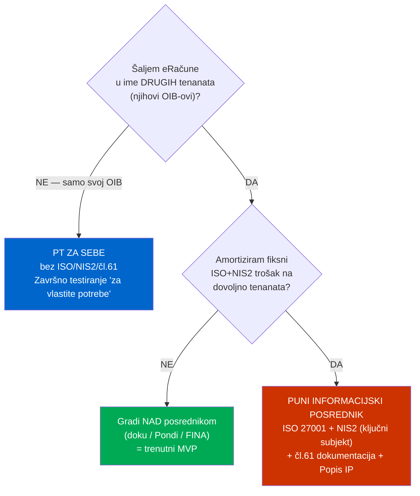
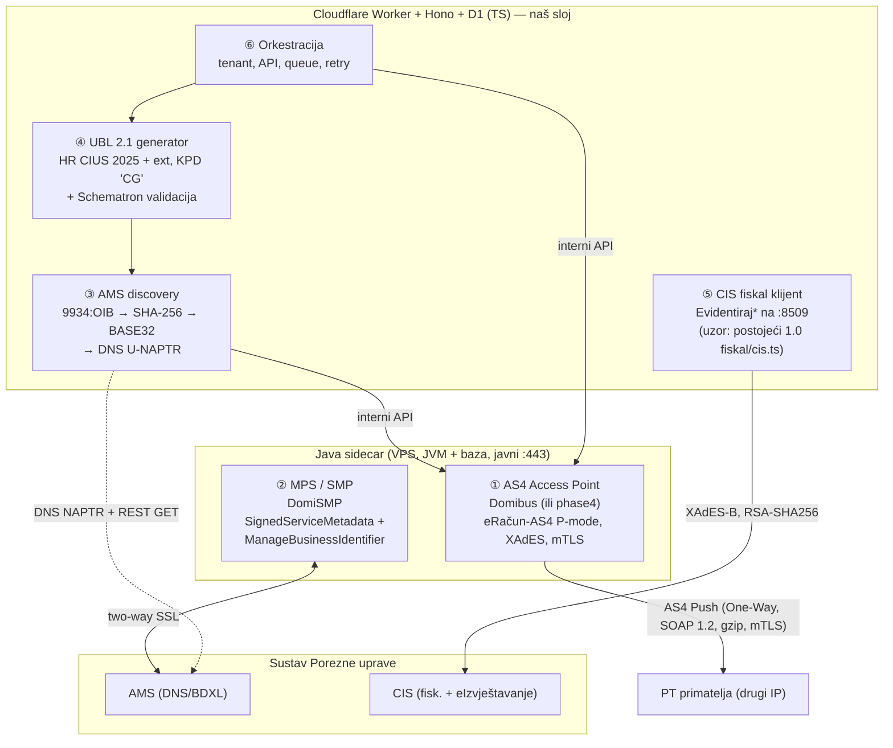
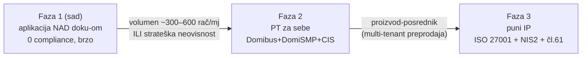

# Vlastita pristupna točka (PT) — build blueprint

> Izvedbeni nacrt „Opcije A" iz `docs/knowledge/12-vlastita-pristupna-tocka.md` (tehnika/pravni okvir),
> `13-provideri-krajolik.md` (krajolik) i `15-ekonomija-i-troskovi.md` (kada se isplati). Ovaj dokument
> je **kako složiti**, ne **što je** — činjenice i izvori su u `12/13/15`.
>
> Aktualni MVP ide **preko posrednika doku** (vidi `eracun-doku-integracija.md`); vlastita PT je
> **Faza 2** — gradi se tek kad volumen/strateška neovisnost to opravda.

## 0. Prva odluka — mijenja SVE

Vlastita PT za **multitenant SaaS** = **puni informacijski posrednik** (ISO 27001 + NIS2 + čl. 61).
„PT za sebe" (bez ISO/NIS2) pokriva **samo vlastiti OIB** / promet gdje si ti izdavatelj.

Ekonomija (`15-*` §3.3): za **jedan OIB** vlastita PT se troškovno **gotovo nikad ne isplati** —
posrednik naplaćuje ~0,08–0,10 €/rač, a fiksni trošak vlastite PT (osobito mjeseci razvoja) je velik.

## 1. Arhitektura — 6 komponenti (što gdje živi)

AS4/ebMS3 + XAdES + mTLS + SBDH je **JVM teritorij** → **Java sidecar** na VPS-u s javnim `:443`;
Cloudflare Worker ostaje aplikacijski/orkestracijski sloj.

| # | Komponenta | Gdje | Gotov alat |
|---|---|---|---|
| ① | AS4 Access Point | Java sidecar | **Domibus** (PU daje P-mode XML) ili `phase4` |
| ② | MPS (SMP) | Java sidecar | **DomiSMP** |
| ③ | AMS discovery | Worker/Node | vlastiti kod (DNS U-NAPTR + HTTPS GET) |
| ④ | UBL 2.1 + SBDH | Worker/TS | `ph-ubl`/`phive` za validaciju |
| ⑤ | CIS fiskal klijent | Worker (`sockets`+`subtls`) | uzor postojeći `fiskal/cis.ts` |
| ⑥ | Orkestracija | Worker/Hono | `domovina-fiskal` |

**Certifikati:** jedan kvalificirani X.509 (FINA ~49,78 €/5g ili **Certilia/AKD 20 €/5g**) s OIB-om u
atributu — koristi se za AS4 XAdES potpis, MPS→AMS mTLS, MPS TLS (EV), potpis `SignedServiceMetadata`.
Za B2C 1.0 (ZKI) ostaje zaseban FINA cert koji tenant već ima.

**Peppol NE treba** za domaći HR↔HR promet (HR ima vlastiti AMS/MPS/`eRačun-AS4`). Peppol samo za
prekogranično (FINA je AP) — zaseban projekt.

## 2. Redoslijed sastavljanja

```mermaid
flowchart LR
  P0["0. Preduvjeti<br/>ePorezna + Tester (PTS)<br/>kval. cert (FINA/AKD)<br/>PU doc 140/141/142/105"]
  P1["1. UBL (④)<br/>HR CIUS generator<br/>→ zeleno u Validatoru"]
  P2["2. Domibus (①)<br/>eRačun-AS4 P-mode<br/>self-send echo"]
  P3["3. DomiSMP (②)<br/>SignedServiceMetadata<br/>+ ManageBusinessIdentifier"]
  P4["4. AMS discovery (③)"]
  P5["5. CIS fiskal (⑤)<br/>Evidentiraj*, :8509"]
  P6["6. Orkestracija (⑥)<br/>UBL→discovery→Domibus→CIS"]
  P7["7. PTS: opcionalno<br/>→ Završno testiranje"]
  P8["8. Produkcija<br/>objava u AMS preko MPS-a"]

  P0 --> P1 --> P2 --> P3 --> P4 --> P5 --> P6 --> P7 --> P8
```

Bilješke po koraku:
1. **UBL prvo** — najviše aplikativne vrijednosti, bez JVM-a. *Bloker (gap-analiza R17): potvrdi
   `fin/2024` namespace/shemu i KPD `listID="CG"` format prije koda.*
2. Domibus: Tomcat + MySQL/PostgreSQL, javni `:443`, P-mode iz PU doc 140 Prilozi 4–5.
5. CIS eRačun ide na **`:8509`** (razlikuje se od B2C 1.0 `:8449`!), XAdES-B enveloped RSA-SHA256.
7. PTS „za vlastite potrebe" → **bez** čl. 61 / ISO / NIS2. „Za druge" → svi fiskalni scenariji + dokumentacija.
8. Tek nakon Završnog testiranja smiješ objavljivati u AMS.

## 3. Trošak (sažetak iz `15-*`)

- **PT za sebe:** cert ~10 €/god + VPS ~200–800 €/god. Glavni trošak = **mjeseci razvoja** +
  održavanje uz promjene PU spec-a. ISO/NIS2 = **0** (nije obveznik po pragu veličine).
- **Puni IP:** dodaje **ISO 27001 ~10–25k € + ~2–5k €/god** i **NIS2 program** — čini vlastitu PT
  ekonomски opravdanom tek kad je razmjena core proizvod koji se preprodaje mnogima.

## 4. Kada preći s posrednika na vlastitu PT

