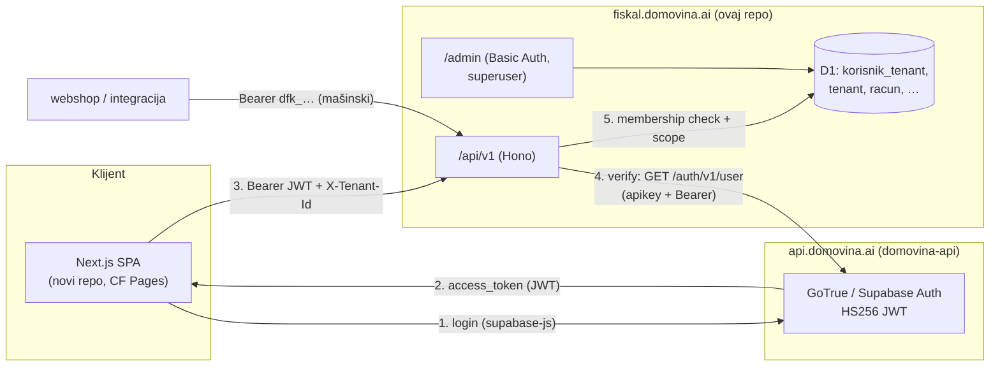

# 16 — Dashboard za krajnje korisnike + SSO (dijeljeni GoTrue)

> SPOT za **customer dashboard** (self-service izdavanje računa) i **jedinstveni
> identitet** kroz Domovina ekosustav. Odluke donesene 2026-07-06 (Matija).
> Implementacijski prompt: `docs/handoff/dashboard-sso.md`.

## 1. Cilj i opseg

Krajnji korisnik (vlasnik SME-a ili knjigovođa) prijavi se **jednom** i dobije
pristup do **M od ukupnih N** tenanata, s **dropdown prebacivanjem** tenanta i
**punim self-serviceom** (kreiranje/izdavanje/fiskalizacija/slanje računa,
katalog proizvoda, prostori/uređaji/operateri).

Auth ide preko **postojećeg SSO-a** — self-hostani Supabase/GoTrue u repou
`domovina-api` na `api.domovina.ai`, isti identitet koji već koriste
`domovina.ai` (Flutter) i `pinka.io` (Next.js). Cilj (Matijin, doslovno):
*"jedan auth backend za više servisa koji rade specific jobove"*.

## 2. Ključne odluke

| # | Odluka | Obrazloženje |
|---|--------|--------------|
| **D1** | Frontend = **novi Next.js repo**, po uzoru na `pinka-finance/app` | Cijeli ekosustav je SPA-klijent + GoTrue sesija + job-specific API. Konzistentnost, minimalno novih obrazaca. |
| **D2** | Fiskal Worker ostaje **čisti job-specific API**; dashboard je **API klijent** | Fiskalni podaci su u **D1**, ne u Supabaseu → dashboard NE čita Supabase RLS-om (za razliku od pinke), nego zove `fiskal.domovina.ai/api/v1` s korisnikovim JWT-om. |
| **D3** | **Identitet** u GoTrue; **autorizacija** (tenant-membership + uloge) u fiskal **D1** | App-specific authz živi u aplikaciji, keyed po stabilnom GoTrue `user_id` (uuid `sub`), s email-bind fallbackom. GoTrue se NE zna ništa o tenantima. |
| **D4** | JWT verifikacija = **delegacija na GoTrue `/auth/v1/user`** | Bez dijeljenja HS256 secreta u još jedan servis (blast-radius). Autoritativno (poštuje logout/ban). ⚠️ Asimetrični JWT (JWKS) je čist end-state — kasnije (§8). |
| **D5** | `/admin` (Basic Auth superuser, vidi svih N) ostaje **netaknut i odvojen** | Superuser konzola i customer dashboard = dva auth realma, dvije authz skopije, različit blast-radius. Ne miješati. |

## 3. Arhitektura



Dva puta autentikacije na **istom** `/api/v1`:
- **Mašinski (postojeći):** `Authorization: Bearer dfk_…` → SHA-256 → `api_kljuc` → tenant. Za webshopove/integracije.
- **Korisnički (novo):** `Authorization: Bearer <GoTrue JWT>` + `X-Tenant-Id: <id>` → verify vs GoTrue → `korisnik_tenant` → tenant. Za dashboard.

## 4. Model podataka — migracija `0005_dashboard_korisnici.sql`

```sql
-- Pristup krajnjih korisnika (dashboard) tenantima. Identitet je u GoTrue;
-- ovdje živi SAMO autorizacija (koji user → koji tenant, koja uloga).
CREATE TABLE korisnik_tenant (
  id          INTEGER PRIMARY KEY,
  tenant_id   INTEGER NOT NULL REFERENCES tenant(id) ON DELETE CASCADE,
  user_email  TEXT NOT NULL,              -- ono što superuser unese u /admin
  user_id     TEXT,                       -- GoTrue sub (uuid); NULL dok se ne veže
  uloga       TEXT NOT NULL DEFAULT 'vlasnik'
                CHECK (uloga IN ('vlasnik','knjigovodja','operater')),
  aktivan     INTEGER NOT NULL DEFAULT 1,
  bound_at    TEXT,                        -- kad je user_id vezan (prva prijava)
  created_at  TEXT NOT NULL DEFAULT (datetime('now'))
);
CREATE UNIQUE INDEX ux_kt_tenant_email ON korisnik_tenant(tenant_id, lower(user_email));
CREATE INDEX ix_kt_user_id ON korisnik_tenant(user_id);
CREATE INDEX ix_kt_user_email ON korisnik_tenant(lower(user_email));
```

**Email→user_id vezanje:** superuser dodaje pristup po **emailu** (zna email, ne
zna GoTrue `sub`). Na **prvoj prijavi** Worker iz JWT-a dobije `sub`+`email`,
pronađe redak po verificiranom emailu i upiše `user_id` (`bound_at`). Nakon toga
match ide po `user_id` (stabilan). GoTrue email je verificiran → email match je
siguran za bootstrap. ⚠️ Promjena emaila u GoTrue je edge-case (§8).

## 5. API — dvorežimski auth middleware

Zamijeniti postojeći `apiV1.use('*', …)` (`backend/src/api/racuni.ts:44`) granom po **obliku tokena**:

- Token počinje `dfk_` → **postojeći** API-key put (nepromijenjen).
- Token je JWT (`eyJ…`, tri segmenta) → **korisnički** put:
  1. `GET ${SUPABASE_URL}/auth/v1/user` s `apikey: <ANON_KEY>` + `Authorization: Bearer <JWT>`. 401 → nevažeći.
  2. Iz odgovora uzmi `{ id (sub), email }`.
  3. Pročitaj `X-Tenant-Id` header. Ako nema → **400** (`"Nedostaje X-Tenant-Id"`).
  4. `SELECT … FROM korisnik_tenant WHERE tenant_id=? AND aktivan=1 AND (user_id=? OR (user_id IS NULL AND lower(user_email)=lower(?)))`.
     - Nema retka → **403** (`"Korisnik nema pristup tom tenantu"`).
     - Match po emailu i `user_id IS NULL` → **veži** (`UPDATE … SET user_id=?, bound_at=…`).
  5. `c.set('tenant', <TenantRow za tenant_id>)`, `c.set('korisnik', { sub, email, uloga })`.

Downstream route handleri se **ne mijenjaju** — svi već čitaju `c.get('tenant')`.

**Verify cache (opcionalno, preporuka):** keširaj GoTrue user-lookup po tokenu
~30–60 s (in-memory Map ili KV) da se izbjegne mrežni hop na svaki poziv.

## 6. Novi endpointi (korisnički mod)

| Metoda | Put | Auth | Opis |
|--------|-----|------|------|
| `GET` | `/api/v1/moji-tenanti` | JWT (bez `X-Tenant-Id`) | `[{ tenantId, oib, naziv, uloga }]` — puni dropdown za tenant-switch. |
| `GET` | `/api/v1/ja` (opc.) | JWT | `{ email, tenanti: [...] }` — profil + membershipi. |

Svi ostali (`POST /racun`, `/racun/:id/izdaj`, `/fiskaliziraj`, `/posalji`,
`GET /racun`, `/proizvod`, `/kpd`, `/racun/:id/pdf`) rade **nepromijenjeno** pod
korisničkim modom — tenant dolazi iz `X-Tenant-Id`.

⚠️ **Uloge (v1, minimalno):** `vlasnik`/`knjigovodja` = puni pristup; `operater`
= smije izdavati/fiskalizirati ali ne mijenjati postavke (prostori/uređaji/ključevi).
Enforcement točka: middleware postavi `uloga`, a `POST` rute za postavke provjere `uloga !== 'operater'`.

## 7. CORS (novo)

Dodati Hono `cors` na `/api/v1` (SPA je cross-origin):
- `origin`: `DASHBOARD_ORIGIN` (CSV: prod dashboard domena + `http://localhost:3000`).
- `allowHeaders`: `Authorization, Content-Type, X-Tenant-Id`.
- `allowMethods`: `GET, POST, OPTIONS`.
- Preflight `OPTIONS` mora proći **prije** auth middlewarea.

## 8. Sigurnost i trajektorija

- **Anon key je public-safe** (kao u pinki) — smije u SPA bundle i kao Worker var.
- **HS256 `JWT_SECRET` NE ide u fiskal Worker** — taj secret kuje token bilo kojeg
  korisnika; delegacija na `/auth/v1/user` ga ne treba.
- `X-Tenant-Id` se **uvijek** validira protiv membershipa — ne vjeruj klijentu.
- Membership provjera je **server-side na svaki poziv**.
- **⚠️ Čist end-state:** popuniti prazne `ANON_KEY_ASYMMETRIC`/`SERVICE_ROLE_KEY_ASYMMETRIC`
  slotove u `domovina-api` → GoTrue potpisuje ES256/RS256 → Worker verificira lokalno
  preko **javnog JWKS-a** (`jose`), bez ijednog mrežnog hopa i bez secreta. Migracija
  dira produkcijski GoTrue config → odgoditi dok delegacija radi.

## 9. Frontend — novi repo (obrazac = `pinka-finance/app`)

- **Stack:** Next 14 App Router, `output: "export"` (statički SPA) → **Cloudflare Pages** (`@cloudflare/next-on-pages`). Tailwind + lucide + hr i18n (kao pinka).
- **`lib/supabase.ts`:** browser singleton, `NEXT_PUBLIC_SUPABASE_URL` + `NEXT_PUBLIC_SUPABASE_ANON_KEY` (identično pinki).
- **`lib/auth.tsx`:** `AuthProvider` + `AuthGate` (session client-side, `onAuthStateChange`). v1 login: **email OTP + Google OAuth**; Certilia/passkey opcionalno kasnije (lib se može posuditi iz pinke).
- **`lib/fiskal.ts` (NOVO vs pinka):** API klijent koji na svaki poziv lijepi `Authorization: Bearer <session.access_token>` + `X-Tenant-Id: <odabrani>`. Bazni URL `NEXT_PUBLIC_FISKAL_API_URL` (`https://fiskal.domovina.ai/api/v1`).
- **Tenant switcher:** dropdown iz `GET /moji-tenanti`; odabir u contextu + `localStorage`; svi pozivi scope-ani.
- **Stranice:** `/` (AuthGate → login), `/dashboard` (popis računa), `/dashboard/novi` (kreiranje dokumenta), `/dashboard/racun/[id]` (detalj + izdaj/fiskaliziraj/pošalji/PDF), `/dashboard/proizvodi`, `/dashboard/postavke` (prostori/uređaji/operateri — self-service).
- **⚠️ GoTrue redirect URLs:** dodati dashboard domenu (+ `http://localhost:3000`) u `ADDITIONAL_REDIRECT_URLS` u **`domovina-api`** (Coolify env). Zahtjev izvan ovog repoa.

## 10. Env / secrets

**Fiskal Worker (`wrangler.toml` + secrets):**
- `SUPABASE_URL` (var, `https://api.domovina.ai`)
- `SUPABASE_ANON_KEY` (var — public-safe)
- `DASHBOARD_ORIGIN` (var, CSV origina za CORS)

**Novi Next repo (`.env`):**
- `NEXT_PUBLIC_SUPABASE_URL`, `NEXT_PUBLIC_SUPABASE_ANON_KEY`
- `NEXT_PUBLIC_FISKAL_API_URL`

## 11. Superuser admin — dodjela pristupa

Novi odjeljak u `/admin/tenant/:id`: **"Dashboard pristup"** — forma `email + uloga`
→ `INSERT korisnik_tenant (tenant_id, user_email, uloga)` (`user_id` NULL, veže se
na prvoj prijavi). Lista postojećih + deaktivacija. (Superuser ostaje jedini koji
otvara pristup — nema samoregistracije u v1.)

## 12. Definicija gotovog (verify)

1. Migracija 0005 primijenjena; `korisnik_tenant` postoji.
2. Korisnički auth mod: JWT + `X-Tenant-Id` → scope radi; krivi tenant → 403; bez headera → 400.
3. `GET /moji-tenanti` vraća membershipe; email→user_id vezanje radi na prvoj prijavi.
4. CORS dopušta dashboard origin; preflight prolazi.
5. Mašinski `dfk_` put i dalje radi (regresija).
6. Novi Next repo: login (email OTP + Google) → dropdown tenanata → izdavanje/fiskalizacija/slanje kroz API.
7. `/admin` "Dashboard pristup" dodaje/uklanja korisnike.
8. `.claude/skills/verify` prolazi; commit + push (oba repoa).

## 13. Status implementacije (2026-07-06)

Implementirano u ovom repou (v0.4.0) i u novom repou `domovinatv/domovina-fiskal-app`:

- **Backend:** migracija 0005, dvorežimski auth middleware (`src/api/racuni.ts`),
  GoTrue verify s ~60 s in-memory cacheom (`src/auth/gotrue.ts`), `GET /moji-tenanti`
  + `GET /ja`, CORS, `/admin` odjeljak „Dashboard pristup". Verificirano lokalno
  s pravim GoTrue JWT-om: 400 bez `X-Tenant-Id`, 403 za tuđi tenant, email→`user_id`
  bind na prvoj prijavi, `dfk_` regresija, CORS preflight (nepoznat origin bez ACAO).
- **Dopuna izvan minimuma:** `GET /api/v1/postavke` + `POST /api/v1/postavke/{prostor|uredjaj|operater}`
  — dashboard forma za novi dokument treba popis prostora/uređaja/operatera, a §6
  enforcement točka (operater bez postavki → 403) treba rute koje štiti. Radi i pod
  `dfk_` modom (mašinski ključ = puni tenant-scoped pristup).
- **Frontend (`domovina-fiskal-app`):** Next 14 `output: export`, prijava email OTP +
  Google, tenant switcher (context + localStorage), stranice po §9. Odstupanje:
  detalj dokumenta je **`/dashboard/racun?id=N`** (query param) umjesto `[id]` rute —
  statički export ne podržava dinamičke segmente bez `generateStaticParams` (isti
  obrazac kao pinka `?slug=`). Proizvodi su v1 read-only (unos traži KPD picker → /admin).
- **Domena (odluka):** `fiskal-app.domovina.ai` — jedna razina ispod `domovina.ai`
  (universal SSL ne pokriva `*.fiskal.domovina.ai`). `DASHBOARD_ORIGIN` u
  `wrangler.toml` = ta domena + `domovina-fiskal-app.pages.dev` + `http://localhost:3000`.
- **Produkcija (2026-07-06):** backend deployan (migracija 0005 remote + `wrangler
  deploy`, verzija `9bf7769b`); frontend deployan na CF Pages projekt
  `domovina-fiskal-app` (https://domovina-fiskal-app.pages.dev, radi); custom domena
  `fiskal-app.domovina.ai` dodana na Pages projekt (status *pending*).
- ⚠️ **Preostalo (ručno):** (1) DNS CNAME `fiskal-app` → `domovina-fiskal-app.pages.dev`
  (proxied) u zoni `domovina.ai` — lokalni CF tokeni nemaju DNS write scope;
  (2) dodati `https://fiskal-app.domovina.ai/**` i `https://domovina-fiskal-app.pages.dev/**`
  u `ADDITIONAL_REDIRECT_URLS` u `domovina-api` Coolify env
  (`http://localhost:3000/**` već postoji, provjereno 2026-07-06).

## 14. Izvori (pristup 2026-07-06)

- `pinka-finance/app`: `lib/supabase.ts`, `lib/auth.tsx`, `next.config.mjs`, `package.json`, `app/` (App Router, `output: export`, CF Pages).
- `domovina-api`: `.env.example` (`GOTRUE_SITE_URL`, `ADDITIONAL_REDIRECT_URLS`, JWT HS256 iz `SERVICE_PASSWORD_JWT`, prazni `*_ASYMMETRIC`), `supabase/config.toml` (`site_url`, `verify_jwt=false`), `supabase/functions/pinka-contribute/index.ts` (`userClient.auth.getUser()` obrazac).
- Ovaj repo: `backend/src/api/racuni.ts:44` (Bearer middleware), `src/types.ts` (`Env`, `ApiVarijable`, `TenantRow`), `migrations/0001_init.sql` (`tenant`, `api_kljuc`), `wrangler.toml`.
