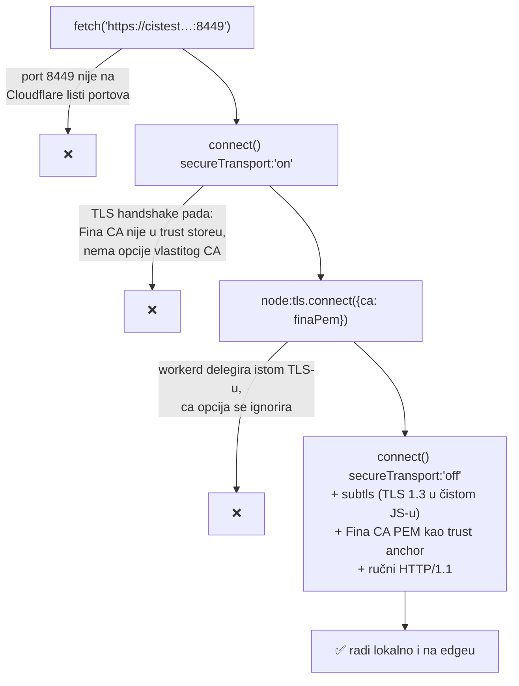
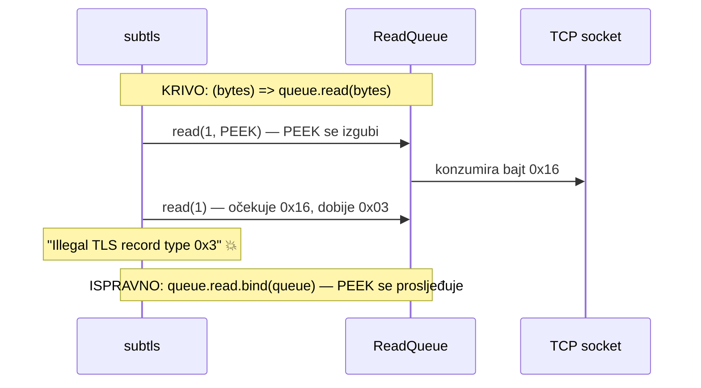
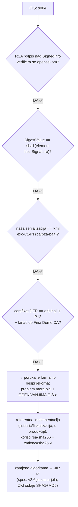
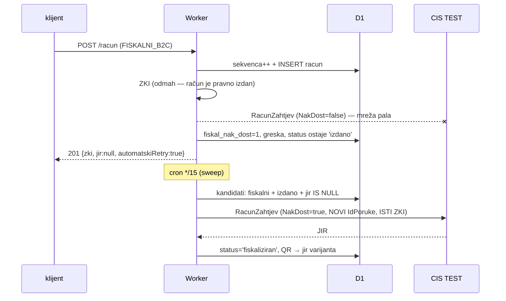
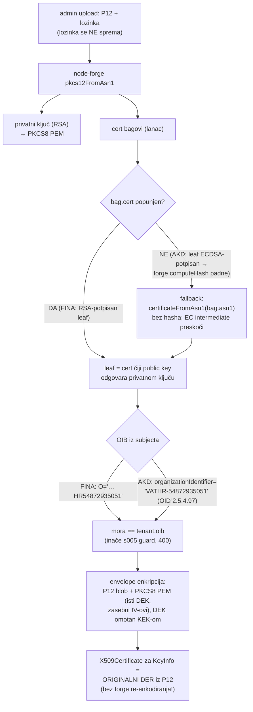
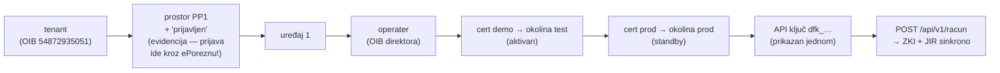

# Faza 2 — dnevnik implementacije B2C fiskalizacije (2026-07-05)

> Kronologija, odluke i debugging koraci koji NISU vidljivi iz samog koda —
> komplement činjeničnim dopunama u `02-*` §6.1/§12 i `04-*` §5.1. Pisano nakon
> uspješnog E2E (JIR s CIS TEST-a, lokalno i s produkcije, FINA i AKD certifikatima).

## 1. Arhitektura koja je na kraju ispala (bez sidecara!)

```mermaid
flowchart LR
    subgraph CF["Cloudflare Worker (fiskal.domovina.ai)"]
        API["POST /api/v1/racun\n(Bearer → tenant)"] --> VAL["zod validacija\n+ PDV pravila"]
        VAL --> SEQ["sekvenca 'fiskalni'\n(atomski D1 batch)"]
        SEQ --> ZKI["ZKI = md5(rsaSha1(oib+datum␣+br+PP+NU+iznos))\nnode:crypto, ključ dekriptiran u memoriji"]
        ZKI --> XML["RacunZahtjev XML\nkanonski-po-konstrukciji (exc-C14N)"]
        XML --> DSIG["XML-DSIG enveloped\nRSA-SHA256 + SHA-256 digest"]
        DSIG --> TLS["cloudflare:sockets (TCP)\n+ subtls (TLS 1.3 u JS-u)\ntrust anchor = Fina CA PEM"]
    end
    TLS -->|"SOAP :8449"| CIS["CIS TEST\ncistest.apis-it.hr"]
    CIS -->|"JIR ili sNNN"| PARSE["parsiranje odgovora\n→ racun.jir / fiskal_greska\n→ poruka_log audit"]
    PARSE --> QR["fiskalni QR\nporezna.gov.hr/rn?jir=…"]
    QR --> PDF["PDF blok 'Fiskalni podaci'\nZKI + JIR + QR (bwip-js)"]
    CRON["cron */15\nsweep naknadne dostave"] -.->|"NakDost=true, novi IdPoruke, ISTI ZKI"| XML
```

Ključno: **sva tri povijesna razloga za sidecar su otpala** — MD5/node:crypto rade
na Workers (znano od ranije, `11-*`), transportni mTLS **nije obavezan**
(empirijski), a problem privatnog Fina CA riješen je subtls-om.

## 2. Zašto transport nije trivijalan — stablo odluke

CIS govori HTTPS na portu **8449**, a poslužiteljski certifikat mu izdaje
**privatni Fina CA** (test: `Fina Demo CA 2020`, prod: `Fina RDC 2020`) koji ne
postoji u javnim trust storeovima — i server **ne šalje intermediate**, samo leaf.

Preduvjeti za subtls provjereni openssl-om: CIS TEST **i** PROD podržavaju
TLS 1.3 s `TLS_AES_128_GCM_SHA256` + P-256 (jedina kombinacija koju subtls zna).
Produkcijski CA nađen preko **AIA ekstenzije** leafa
(`http://rdc.fina.hr/RDC2020/FinaRDCCA2020.cer`) — nije ga bilo na webu za skinuti.

### Bug koji je pojeo sat vremena: subtls PEEK

subtls interno zove `networkRead(bytes, mode)` gdje je `mode` **PEEK** — wrapper
`(bytes) => queue.read(bytes)` guta drugi argument, PEEK postane konzumirajuće
čitanje, stream se pomakne za 1 bajt i handshake pukne s kriptičnim
`Illegal TLS record type 0x3`. Fix: `queue.read.bind(queue)`.

## 3. Misterij `s004` — bisekcija digitalnog potpisa

Prvi potpisani `RacunZahtjev` (RSA-SHA1/SHA1, točno po spec. v2.6 §7) CIS je
odbio: `s004 Neispravan digitalni potpis`. Bisekcija je isključila sve lokalno:

Pouka: kad je poruka kriptografski samo-konzistentna a server je odbija,
uspoređuj s implementacijom koja **danas** radi u produkciji, ne sa specifikacijom.

## 4. exc-C14N "po konstrukciji" (bez xml-crypto)

XML se serijalizira odmah u kanonskom obliku pa su potpisani bajtovi identični
onima koje će CIS-ov parser + exc-C14N reproducirati: bez whitespacea među
tagovima, `xmlns` deklaracije prije atributa, escape `& < >` (+ CR) u tekstu,
prazni elementi kao ``. Verificirano bajt-za-bajt protiv `lxml`
`c14n(exclusive=True)` i prihvaćeno od CIS-a. Time otpada rizična ovisnost
(`xml-crypto` na workerd runtimeu — ⚠️ iz `11-*` §1).

## 5. Naknadna dostava — simulirani offline

Pravila iz `02-*` §8 ispoštovana: novi `IdPoruke` na svako slanje, ZKI i
`DatVrijeme` nepromijenjeni; rok = **2 radna dana** (čl. 21. st. 2., R15).
Retry klasifikacija: transport/`s006`/HTTP → automatski; `s001–s005`/`s013` →
čeka ispravak (ručni retry `POST /racun/:id/fiskaliziraj` ili admin gumb).

## 6. Certifikati: FINA vs AKD/Certilia u parseru

AKD nalazi (E2E potvrđen JIR-om): kupnja na `developer.certilia.com/services/fiscal`,
RSA 3072, 5 god., moderni P12 (bez `-legacy`), besplatna regeneracija. CIS TEST
prihvaća TESTCERTILIA lanac bez ikakve posebne registracije.

## 7. Onboarding ITalk d.o.o. na produkciji (redoslijed koraka)

## 8. Što je namjerno odgođeno / otvoreno

| Stavka | Status |
|---|---|
| Verifikacija potpisa CIS **odgovora** (inkluzivni C14N asimetrija) | TODO — MVP vjeruje TLS-u (subtls verificira server cert) |
| Prelazak na PROD CIS | čeka min. 2 dana stabilnog TEST rada → `OKOLINA=prod` + prod cert već uploadan |
| **Čišćenje probnih računa prije pravog prod rada** | probni računi (TEST CIS) troše slijed `fiskalni/PP1/2026` u našoj D1 — prije prvog PRAVOG računa obrisati probne zapise ili krenuti s novim prostorom, da slijed u produkcijskoj Poreznoj kreće od 1 |
| `ProvjeraZahtjev` (TEST-only validacija) | builder je spreman (`zahtjevXml('ProvjeraZahtjev', …)`), endpoint nije izložen |
| Vlastiti DKIM za email (Resend primaran) | naslijeđeno iz faze 1, v. PLAN.md |

## 9. Gdje su tajne (NIKAD u repo)

`backend/.tajne/` (gitignored): FINA demo+prod P12 (do 2030.), AKD demo+prod P12
(do 2031.), `lozinke.env` (P12 lozinke, produkcijski admin kredencijali —
**rotirani 2026-07-05**, ITalk API ključ). Produkcijski Worker secreti:
`ADMIN_*`, `ENC_MASTER_KEY` (ne izgubiti — envelope enkripcija!), `RESEND_API_KEY`.
