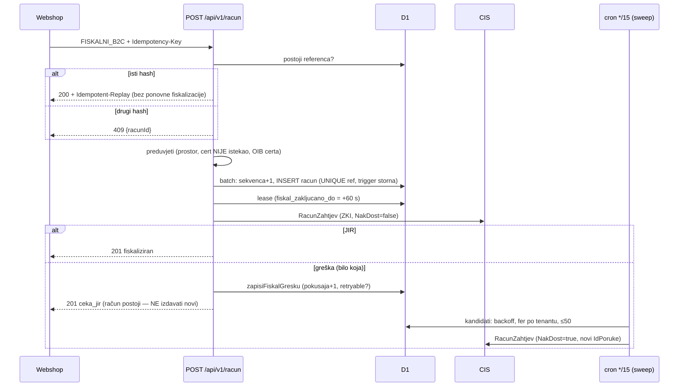

# Faza 4 — dnevnik implementacije produkcijske B2C fiskalizacije (2026-10-01)

Plan: [`docs/handoff/faza-4-produkcija-b2c-webshop.md`](../handoff/faza-4-produkcija-b2c-webshop.md)
(tablica stanja po koracima na vrhu). Ovdje su odluke, nalazi i zamke koje se
ne vide iz koda.

## 1. Tok fiskalnog računa nakon faze 4

## 2. Testna infrastruktura (4.7)

- **vitest 4 + `@cloudflare/vitest-pool-workers` 0.22** (`cloudflareTest` plugin,
  `wrangler.toml` s `environment: 'test'`). Migracije se primjenjuju u
  `test/pomocno/setup.ts` prije svake datoteke. D1 stanje se dijeli među
  testovima jedne datoteke, pa svaki test radi na vlastitom tenantu
  (nasumičan valjan OIB).
- ⚠️ **`vi.mock` ne djeluje na module koje uvozi kod pod testom** (provjereno:
  `vi.isMockFunction` je u testu `true`, a `fiskalizacija.ts` i dalje zove pravi
  `soapPoziv` → pravi CIS TEST vratio `s002` za samopotpisani cert). Rješenje je
  eksplicitni `postaviCisTransport()` u `cis.ts`; setup ga prije svakog testa
  postavlja na funkciju koja baca, pa **nijedan test ne može dosegnuti pravi CIS**.
- U repou nema ključeva ni certifikata: `test/globalni-setup.ts` pri svakom
  pokretanju generira RSA ključ, samopotpisani cert i P12 (3DES, kao FINA), a ZKI
  vektor računa Nodeov OpenSSL **neovisno** o kodu pod testom (workerd `node:crypto`).

## 3. Odluke

- **Idempotencija (4.1).** Hash je SHA-256 *kanoničkog* JSON-a modela **nakon**
  zoda (normalizirane stope i iznosi), bez reference. `25` i `'25'`, ili drukčiji
  redoslijed polja, daju isti hash. Referenca se provjerava **prije** preduvjeta:
  ponovljeni zahtjev dobiva postojeći račun i kad je cert u međuvremenu istekao.
  Utrka: drugi `INSERT` padne na `ux_racun_vanjska_referenca`, D1 batch je
  transakcija, pa se `sekvenca+1` vraća unatrag. Test na razini baze to dokazuje
  (`test/idempotencija.test.ts`).
- **Lease umjesto locka (4.2).** `UPDATE … WHERE fiskal_zakljucano_do IS NULL OR
  < now RETURNING id` je atomski u D1. Lease istječe sam nakon 60 s (CIS timeout
  je 15 s), pa pad Workera ne zaključava račun trajno. Lease se uzima **prije**
  čitanja konteksta, da ZKI/NakDost nisu zastarjeli.
- **Što je retryable.** Nedostupan, istekao ili neispravan cert, krivi OIB certa i
  iznimka pri potpisu jesu retryable: rješava ih upload novog certa, a sweep onda
  sam dovrši račun. Greška mapiranja nije (traži izmjenu podataka). Takav račun
  diže alarm „bez retryja".
- **Sweep.** `ROW_NUMBER() OVER (PARTITION BY tenant_id …) ≤ 10` (fer raspodjela),
  backoff `CASE WHEN p≥6 THEN 60 ELSE 1<
`.
- **CSRF (4.5).** Provjera `Origin`, inače `Sec-Fetch-Site`. Klijenti bez tih
  zaglavlja (curl, `dodaj-tenant*.sh`) prolaze, jer nisu preglednik s
  automatskim Basic Auth-om.
- **CIS poslužiteljski cert (4.6).** Izvor istine je `tls.userCert.validityPeriod.notAfter`
  iz subtls handshakea (echo ga bilježi). Konstanta u `cis.ts` je samo rezerva.
  Vjerujemo Fina CA-u (do 2030.), ne leafu, pa novi cert istog izdavatelja radi
  bez izmjene koda.

## 4. Nalazi tijekom faze

| Nalaz | Posljedica | Ishod |
|---|---|---|
| **FINA P12 se od `9bbb563` (srpanj) nije mogao uploadati**: `parsirajP12` je preskakao cert bag bez `bag.asn1`, a forge ga postavlja samo kad sam NE uspije parsirati cert (AKD put) | „P12 ne sadrži čitljiv certifikat" za svaki FINA cert, na TEST-u i PROD-u. Zato je na TEST-u ITalku bio aktivan AKD cert | ispravljeno u `90bfda1` + test koji pada na starom kodu |
| ITalkov aktivni TEST cert (AKD, id 3, uploadan 04.07. 23:34) se **ne može dekriptirati** trenutnim test `ENC_MASTER_KEY` (`Decryption failed` pri odmotavanju DEK-a) | Ops bilješka „ENC_MASTER_KEY isti svugdje" ne vrijedi za taj blob. Uzrok nije utvrđen (vjerojatno upload prije postavljanja test secreta) | FINA DEMO cert ponovno uploadan na TEST (id 4); AKD id 3 je sad neaktivan |
| Račun izdan s nedekriptibilnim certom (3/PP1/1 na TEST-u) | Stari kod: `pokusaja=0` zauvijek i blokada sweepa (N2). Novi kod: `pokusaja=1`, retryable, sweep ga je sam dovršio nakon uploada certa | potvrda N2 popravka u stvarnom okruženju (§5) |
| PROD `ADMIN_PASS` | 36 znakova i razlikuje se od TEST-ove (ops bilješka „isti kredencijali" je zastarjela) | nije placeholder, rotacija nije potrebna |
| TEST `ADMIN_PASS` | bio je isti kao lokalni `.dev.vars` (13 znakova) | rotiran (32 znaka), lokalno u `secrets/fiskal-test-admin.env` |
| `wrangler dev` bez `--env test` radi s `OKOLINA=prod` | lokalni FISKALNI_B2C bi išao na **PROD CIS** da postoji prod cert u lokalnoj bazi | lokalne fiskalne probe uvijek s `--env test` |
| PDF storna: „ZA PLATITI: -5,00"; alarm „1 fiskalnih računa" | kozmetika | „ZA POVRAT"; hrvatska množina (`0bc11f4`) |
| CIS poslužiteljski certovi (openssl 01.10.2026.) | TEST `cistest.apis-it.hr` do **12.12.2026.** (Fina Demo CA 2020), PROD `cis.porezna-uprava.hr` do **18.12.2026.** (Fina RDC 2020) | alarm 30 dana ranije. Zadnja zamjena (siječanj 2026., PU obavijest 8137) najavljena je ~mjesec dana unaprijed, TEST dva tjedna prije PROD-a |

## 5. E2E na CIS TEST-u (01.10.2026., tenant ITalk id 1, FINA DEMO cert)

| # | Scenarij | Rezultat |
|---|---|---|
| 1 | B2C `KARTICA` s `vanjskaReferenca` | 201, 4/PP1/1, JIR `9809d090-…`, `NacinPlac=K` |
| 2 | isti zahtjev ponovno | 200 + `Idempotent-Replay: true`, isti id/JIR; drukčiji sadržaj → 409; `GET ?vanjskaReferenca` → isti račun |
| 3 | puni storno (`POST /racun/15/storno`) | 201, 5/PP1/1, −11,25 EUR, JIR dobiven; original → `storniran`; drugi storno → 409 |
| 4 | djelomični storno (redak 1, kol. 1) | 201, 7/PP1/1, −5,00 EUR, JIR dobiven; original ostaje `fiskaliziran`; PDF: „Storno računa br. 6/PP1/1 od 01.10.2026." |
| 5 | CIS nedostupan → naknadna dostava | **lokalno** (`wrangler dev --env test`, pokvaren host): 1/PP9/1 dobio ZKI, `ceka_jir` (transport); nakon popravka `/__scheduled` → `NakDost=true`, novi IdPoruke, JIR. **Na TEST deployu**: 3/PP1/1 (izdan dok cert nije bio dekriptibilan, `pokusaja=1`) cron u 17:00 UTC je sam poslao s `NakDost=true` i dobio JIR `2211a373-…` (sweep: pokušano 1, uspjelo 1) |
| 6 | alarm mail | lokalno: `bez-jira-24h` → `send_email` binding s ispravnim naslovom/tijelom. Na TEST-u nije poslan, jer `ALARM_EMAIL` nije postavljen |
| — | `/api/v1/zdravlje` | 200 `ok:true`, echo i sweep svježi, `posluziteljCertNotAfter` 2026-12-12 |

## 6. Demo certifikat za MARCIDEA d.o.o. (OIB 73208423335)

E2E na tenantu 5 traži **FINA DEMO aplikacijski certifikat na OIB MARCIDEA-e**.
Ne može se nabaviti bez vlasnika ili njegove punomoći:
- FINA: zahtjev za demo certifikat za fiskalizaciju (obrazac na fina.hr →
  Certifikati → Demo certifikati za fiskalizaciju). Integrator smije podnijeti
  zahtjev (`docs/knowledge/04` §3), ali s podacima i potpisom/ovlaštenjem
  obveznika. Stiže P12 + lozinka (aktivacijski podaci).
- Alternativa: AKD TESTCERTILIA (radi s CIS TEST-om; doku portal ga ne prima).
- Kad stigne: admin TEST → tenant 5 → upload P12 (`okolina=test`), pa
  „Označi prijavljen" za prostor `WEB`, pa isti scenarij kao §5.

## 7. Otvoreno nakon faze 4

- PROD (svaki korak uz izričito odobrenje): backup + migracije 0007–0009 +
  deploy, `GET /admin/cis/echo`, prvi pravi PROD račun (ITalk), čišćenje
  2 probna računa s TEST JIR-ovima, zaseban PROD `ENC_MASTER_KEY` (re-upload
  ITalkova prod P12), pravi `DOKU_SOFTWARE_API_TOKEN`, `ALARM_EMAIL` (PROD i TEST).
- TEST: `RESEND_API_KEY` (vrijednost postoji samo kao PROD secret; CF `send_email`
  binding na testu radi, Resend je samo fallback).
- 4.4b webhook prema klijentu (opcionalno); verifikacija potpisa CIS odgovora.
- Nakon zamjene CIS poslužiteljskog certa (prosinac 2026.) ažurirati
  `CIS_POSLUZITELJ_CERT`, ili samo provjeriti da echo vidi novi `notAfter`.
